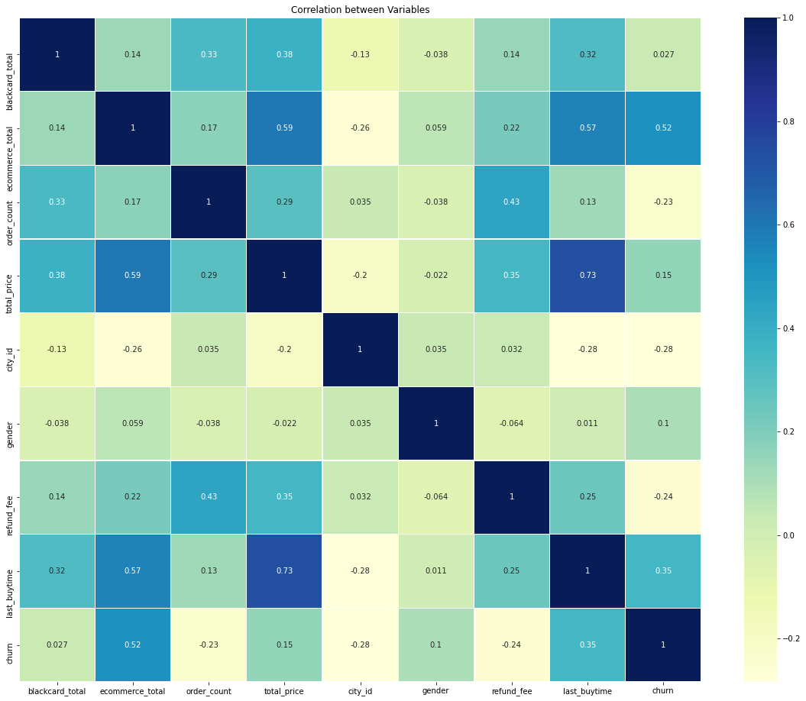
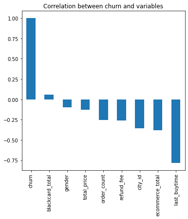
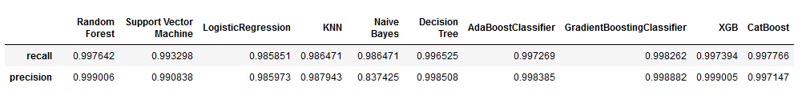

# Customer Churn Prediction Feature Analysis (E-commerce)
Churn is one of the biggest problems in the E-commerce industry. The project firstly retrieves data using PostgreSQL and export all those features in CSV format. And then using Deep Learning Models to make churn prediction. The dataset contains every person who made a purchase either from Department 1, 2 or 3, in other words, the dataset is the User Portrait

### The project is inspired by the project called 'Telecom Churn prediction' from Kaggle
<b>Kaggle Link</b>: <a href=https://www.kaggle.com/bandiatindra/telecom-churn-prediction/comments>Telecom Churn Prediction</a>

### Dataset Description
The following descriptions of the 10 variables in the dataset are taken
from database using PostgreSQL:
<ol>
<li><b>supervision_total</b>: Date format float --> Total Sales from Department 1, aka supervision department </li>
<li><b>blackcard_total</b>: Date format float --> Total Sales from Department 2, aka blackcard department </li>
<li><b>ecommerce_total</b>: Date format float --> Total Sales from Department 3, aka ecommerce department </li>
<li><b>order_count</b>: Date format integer --> number of order for each customer </li>
<li><b>total_price</b>: Date format float --> Sum of total sales from department 1,2 and 3 </li>
<li><b>city_id</b>: Date format float --> ID for each city, For instance, Beijing corresponds to 0101, Shanghai corresponds to  </li>0201
<li><b>gender</b>: Date format integer --> 1: Male 2: Female </li>
<li><b>refund_fee</b>: Date format float --> Total Refund Fees from Department 1,2 and 3</li>
<li><b>last_buytime</b>: Date format integer --> KEY FEATURE: The most recent purchase time, this feature decides wheather churn or not directly </li>
<li><b>churn</b>: (Dependent Variable) Date format integer --> Given that most recent purchase is after 2020-5-1, the user is not considerd as churn user, otherwise the churn returns 1 </li>
</ol>

### Data Preparation
Stored Procedure usging PostgreSQL, the data of this table is originated from various tables in the database
  * uid,user_id to locate each user
  * addtime stands for the time for the user to be added into database
  * jianli_totalprice,heika_totalprice,tuangou_totalprice are sales from different department
  * min_buy_time: the earliest time to make a purchase 
  * max_but_time: the latest time to make a purchase
  * order_count is number of orders for each person
  * total_price is the total amount of purchase each person made


  ```sql
  CREATE TABLE gathers_users 
  AS 
  SELECT uid,user_id,MIN(addtime) AS addtime,
  SUM(CASE WHEN leixing=1 THEN total_price ELSE 0 END) AS jianli_totalprice,
  SUM(CASE WHEN leixing=2 THEN total_price ELSE 0 END) AS heika_totalprice,
  SUM(CASE WHEN leixing=3 THEN total_price ELSE 0 END) AS tuangou_totalprice,
  MIN(min_buy_time) AS min_buy_time,
  MAX(max_buy_time) AS max_buy_time,
  SUM(order_count) AS order_count,
  SUM(total_price) AS total_price
  ```
  * City name and city ID are description of city
  * full_name is the name for each customer
  * gender 1:Male 2:Female
  * refund_fee is the sum of refund fee from Department 1,2 & 3
  * Churn is decided by the max_buy_time, if it is after 2020-5-1, then churn will be 0, else it will be 1.<br/>

  ```sql
  ALTER TABLE gathers_users ADD city_name VARCHAR(30) DEFAULT '';
  ALTER TABLE gathers_users ADD city_id VARCHAR(10) DEFAULT ''; 
  ALTER TABLE gathers_users ADD full_name VARCHAR(50) DEFAULT ''; 
  ALTER TABLE gathers_users ADD gender int DEFAULT NULL;
  ALTER TABLE gathers_users ADD refund_fee int DEFAULT 0; 
  ALTER TABLE gathers_users ADD churn int DEFAULT 0; 
  ```
  
  * Query for necessary Features<br/>
  ```sql
  SELECT jianli_totalprice AS supervision_total, heika_totalprice AS blackcard_total, 
         tuangou_totalprice AS ecommerce_total, order_count, total_price, city_id, 
         gender, refund_fee, latest_timestamp AS last_buytime, churn
  FROM gathers_users
  ```
 ### Import Python Libraries
  ```python
  import numpy as np
  import pandas as pd
  import os
  import matplotlib.pyplot as plt
  import seaborn as sns
  from pylab import rcParams
  import matplotlib.cm as cm
  import sklearn
  from sklearn import preprocessing
  from sklearn.preprocessing import LabelEncoder
  from sklearn.preprocessing import StandardScaler
  from sklearn.model_selection import StratifiedShuffleSplit
  from sklearn.ensemble import RandomForestClassifier
  from sklearn.svm import SVC, LinearSVC
  from sklearn.linear_model import LogisticRegression
  from sklearn.neighbors import KNeighborsClassifier
  from sklearn.naive_bayes import GaussianNB
  from sklearn.tree import DecisionTreeClassifier
  from xgboost import XGBClassifier
  from catboost import CatBoostClassifier
  from sklearn.ensemble import AdaBoostClassifier
  from sklearn.ensemble import GradientBoostingClassifier
  from sklearn.metrics import classification_report, precision_score, recall_score, f1_score
  from sklearn.metrics import confusion_matrix
  from sklearn.model_selection import GridSearchCV
  from sklearn.metrics import make_scorer
  from sklearn.ensemble import VotingClassifier
  from sklearn.decomposition import PCA
  from sklearn.cluster import KMeans
  from sklearn.metrics import silhouette_score
  from sklearn.impute import SimpleImputer
  import warnings
  warnings.filterwarnings('ignore')

  %matplotlib inline
  ```
  
 ### Let us read the data file under the same directory
 ```python
 dataset = pd.read_csv("dataset.csv")
 ```
 ### Dealing with the missing value
 ```python
 dataset.dropna(inplace=True)
 dataset.shape
 OUTPUT -> (11930, 10)
 ```
 ### Casting datatype
 ```python
 dataset['city_id'] = dataset['city_id'].astype(int)
 dataset['gender'] = dataset['gender'].astype(int)
 dataset.info()
 ```
 ### Getting the correlation among each feature
 ```python
 plt.figure(figsize=(20,16))
 ax = sns.heatmap(corr,xticklabels=corr.columns,linewidths=0.2,cmap="YlGnBu",annot=True)
 plt.title("Correlation between Variables")
 ```
 #### Output
  

 ### Coreelation between churn and other variables
 ```python
 plt.figure(figsize=(6,6))
 churn_dummies.corr()['churn'].sort_values(ascending=False).plot(kind='bar')
 plt.title("Correlation between churn and variables")
 ```
 #### Output
 
 
 ### Data Cleaning --> Standardization
 ```python
 dataset[['supervision_total','blackcard_total','ecommerce_total',
         'order_count','total_price','city_id',
         'refund_fee','last_buytime']]=scaler.transform(dataset[['supervision_total','blackcard_total','ecommerce_total',
                          'order_count','total_price','city_id',
                          'refund_fee','last_buytime']])
 ```
 
### Split data into training and testing dataset
The dataset is split into 5 sets, 20% of the data will be used as testing data and 80% will be used for training
```python
sss= StratifiedShuffleSplit(n_splits=5,test_size=0.2,random_state=0)
print(sss)
print("Number of Split Group: ",sss.get_n_splits(X,Y))
for train_index, test_index in sss.split(X,Y):
    print('train: ', train_index, 'test: ',test_index)
    X_train,X_test = X[train_index],X[test_index]
    y_train,y_test = Y[train_index],Y[test_index]
```
#### Output
```python
StratifiedShuffleSplit(n_splits=5, random_state=0, test_size=0.2,
            train_size=None)
Number of Split Group:  5
train:  [27518 25350 31239 ... 26746 31383  6500] test:  [49302 18267 17606 ...  7139  5775 34604]
train:  [ 1603 38461 12414 ... 40911 19855 48721] test:  [29050 29934 43014 ...   941 46615  3955]
train:  [30384 32239 49070 ...  3488 45979 30624] test:  [43636  2536 20470 ... 19075 33575  9731]
train:  [36389 38236 16139 ... 10872 17285 44487] test:  [29083 13002 40794 ... 16074 30882  8728]
train:  [20622 14637 35772 ... 34295 45231 17993] test:  [ 1963  4979  8548 ... 15161  9052  9424]
```

### Fitting the model
Using 10 different classifier to yeild the highest accuracy
 * Random Forest Classifier
 * Support Vector Machine
 * LogisticRegression
 * KNN
 * Naive Bayes
 * Decision Tree
 * AdaBoostClassifier
 * GradientBoostingClassifier
 * XGB
 * CatBoost
```python
Classifiers=[["Random Forest",RandomForestClassifier()],
             ["Support Vector Machine",SVC()],
             ["LogisticRegression",LogisticRegression()],
             ["KNN",KNeighborsClassifier(n_neighbors=5)],
             ["Naive Bayes",GaussianNB()],
             ["Decision Tree",DecisionTreeClassifier()],
             ["AdaBoostClassifier", AdaBoostClassifier()],
             ["GradientBoostingClassifier", GradientBoostingClassifier()],
             ["XGB", XGBClassifier()],
             ["CatBoost", CatBoostClassifier(logging_level='Silent')]  
]

Classify_result=[]
names=[]
prediction=[]
for name,classifier in Classifiers:
    classifier=classifier
    classifier.fit(X_train,y_train)
    y_pred=classifier.predict(X_test)
    recall=recall_score(y_test,y_pred)
    precision=precision_score(y_test,y_pred)
    class_eva=pd.DataFrame([recall,precision])
    Classify_result.append(class_eva)
    name=pd.Series(name)
    names.append(name)
    y_pred=pd.Series(y_pred)
    prediction.append(y_pred)
```

#### Output
  

### Testing the Model
```python
SupervisionTotal = input("Please Enter the total price from Supervision Department: ")
BlackcardTotal = input("Please Enter the total price from Blackcard Department: ")
EcommerceTotal = input("Please Enter the total price from Ecommerce Department: ")
OrderCount = input("Please Enter the total order number: ")
TotalPrice = input("Please Enter the total price: ")
CityID = input("Please Enter City ID: ")
RefundFee = input("Please Enter total refund fee: ")
LatestBuytime = input("Please Enter the lateset purchase timestamp: ")
```
```python
INPUT -->
Please Enter the total price from Supervision Department: 2000
Please Enter the total price from Blackcard Department: 1000
Please Enter the total price from Ecommerce Department: 0
Please Enter the total order number: 5
Please Enter the total price: 3000
Please Enter City ID: 0101
Please Enter total refund fee: 1200
Please Enter the lateset purchase timestamp: 1622509894
```
#### Testing
```python
if model.predict([dataset1[-1]])==0:
    print("The user seems not likely to be churn user")
elif model.predict([dataset1[-1]])==1:
    print("The user is likely to be churn user")
```
```python
The user seems not likely to be churn user
```


